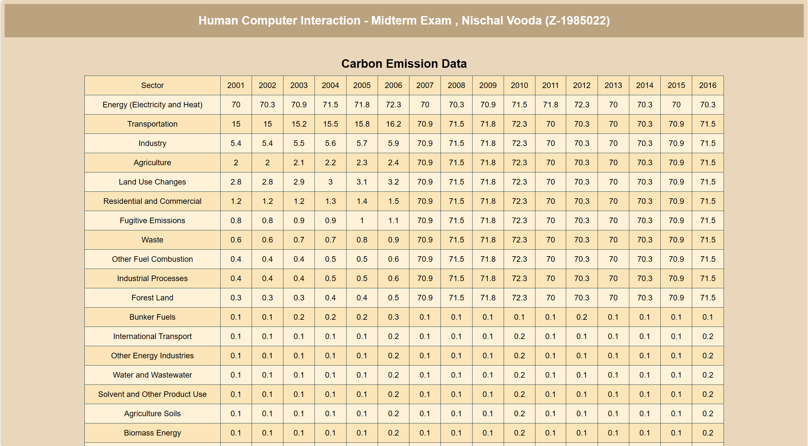
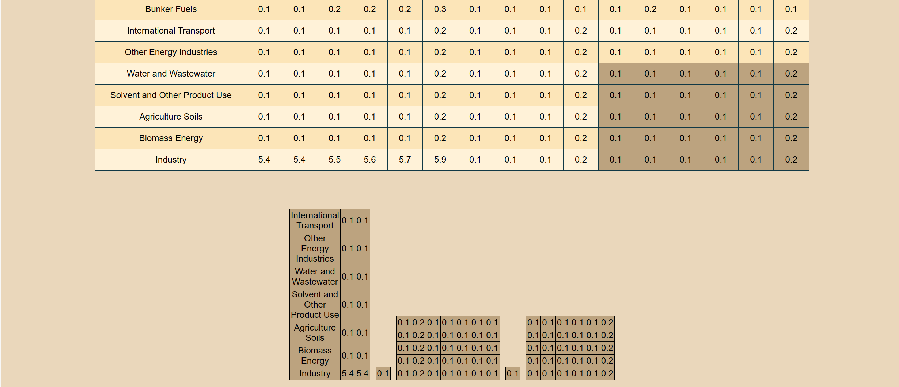

# MatrixSplit-Direct-Manipulation-for-Dynamic-Matrix-Subdivision

<!-- Splitting a Matrix into Submatrices -->
### Splitting a Matrix into Submatrices

<ul>
  <li style="margin-left: 50px;"><a href="https://hciexam1.web.app/">This website is deployed using Google Firebase. Click here to access it.</a></li>
  <li style="margin-left: 50px;">This is a sample matrix related to Carbon Emission.</li>
  <li style="margin-left: 50px;">To divide it into smaller matrices, hold the mouse pointer on a cell and click</li>
  <li style="margin-left: 50px;">Release the mouse button to divide the selected area into a smaller matrix.</li>
  <li style="margin-left: 50px;">To clear the results double click in a black space all the results will be erased</li>
  <li style="margin-left: 50px;">We can do this process multiple times and the results are shown above</li>
  <li style="margin-left: 50px;">This website is also deployed so anyone can access this with https url</li>
</ul>

<!-- Table -->
#### Table

<!-- Select Matrix -->
#### Select Matrix

